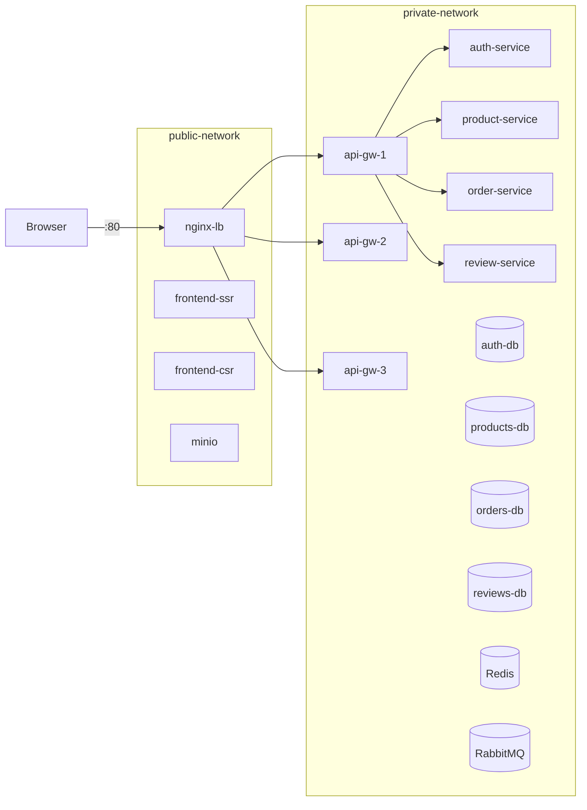
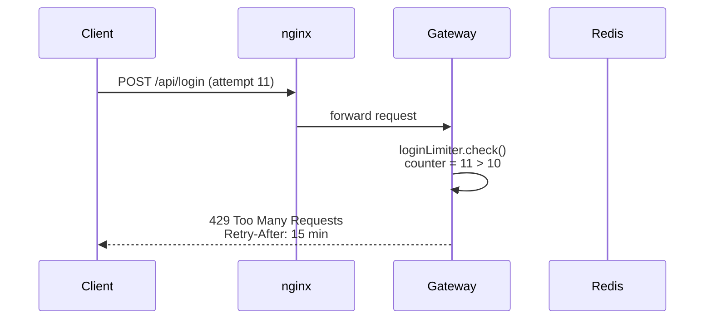
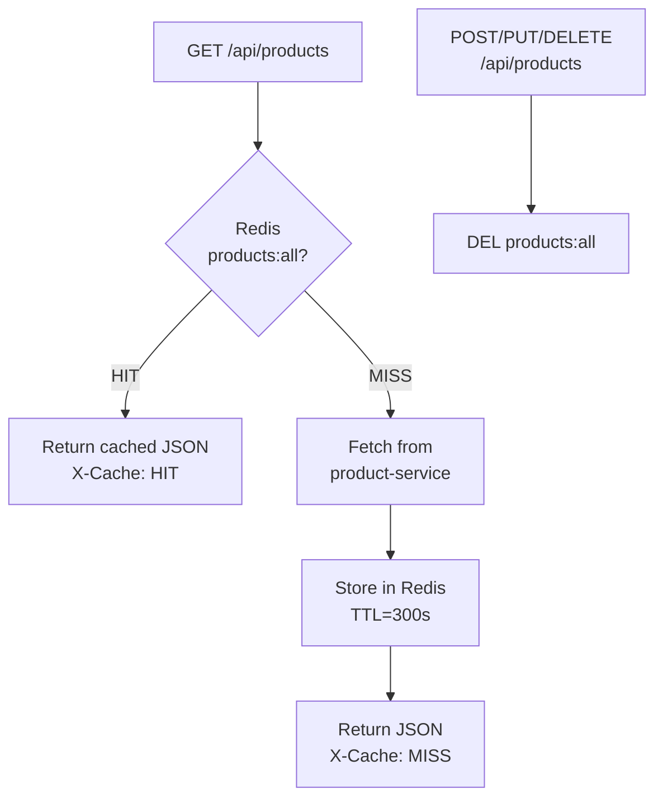
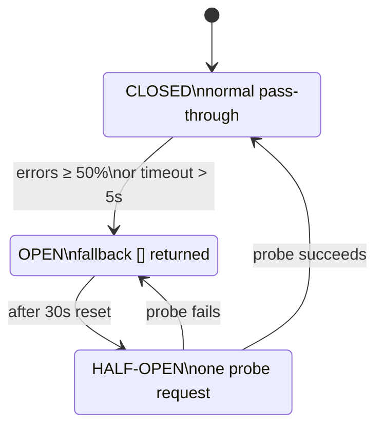
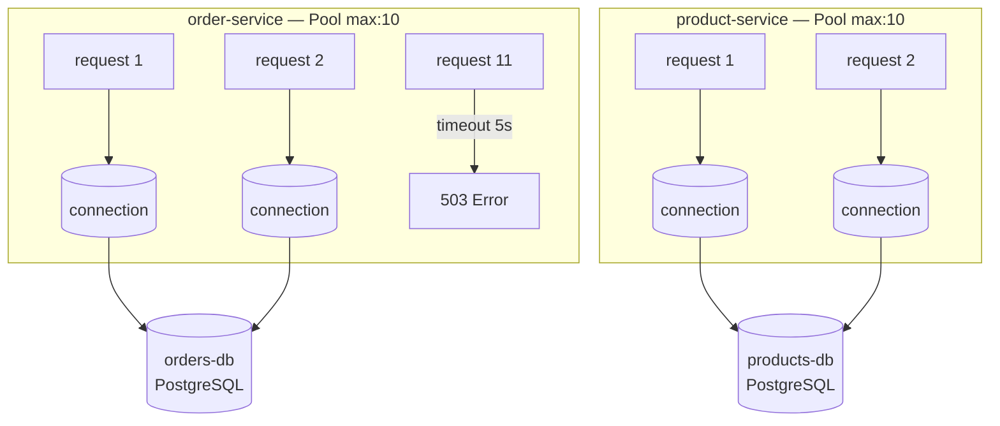

# 🎁 Boutique de Regalos Villapinzón

---

## 1. Team

**Group:** 3f

| # | Full Name |
|---|-----------|
| 1 | Laura Valentina Díaz Velandia |
| 2 | Juan Daniel Gonzalez Sierra |
| 3 | Juan Sebastian Muñoz Lemus|
| 4 | Juan Felipe Hernández Ochoa |
| 5 | Juan David Montenegro Lopez  |

---

## 2. Software System

### Name
**Boutique de Regalos Villapinzón**

### Logo


### Description

Boutique de Regalos Villapinzón is a web-based e-commerce platform designed for a small gift shop located in Villapinzón, Colombia. The system allows customers to browse a product catalog, view product details, manage a shopping cart, place orders, and submit product reviews. It also includes an administrative panel for product management and sales monitoring.

The system is built following a **microservices architecture**, where each business domain is handled by an independent service with its own database, all coordinated through a central API Gateway.

---

## 3. Architectural Structures

### 3.1 Component-and-Connector (C&C) Structure

 #### C&C View

The following diagram illustrates the runtime components of the system and their connectors:


 #### Description of Architectural Elements and Relations

| Element | Type | Technology | Responsibility |
|---------|------|------------|----------------|
| Web Browser | External Client | Host OS / HTTP Client | Generates user input, rendering the visible layouts. Initiates asynchronous web requests towards the application boundary to interact with the catalog, carts, and user panels. |
| Frontend (CSR) | Client Component | HTML5, CSS3, Vanilla JS, Tailwind CSS | Client-Side rendering of the application's user interface. Dynamically fetches and updates DOM content for features like carts and admin dashboards without requesting full page reloads from the server. |
| Frontend SSR | Client Component | Node.js, Express.js | Server-Side computational unit generating pre-rendered HTML views of the application to ensure fast initial page loads and optimal indexing for the store. |
| API Gateway | Orchestrator / Proxy Service | Node.js, Express.js | Central reverse-proxy and request dispatcher. Protects the internal system boundary by providing a unified endpoint. Intercepts incoming traffic, strictly verifies authorization (validates JWT logic internally before delegating requests), and balances loads across inner microservices. |
| Auth Service | Logic Service | C++ Native (GCC, libbcrypt) | Handles intensive cryptographic computing requirements. Responsible for managing credential hashing, executing secure user registration/logins, and generating valid JSON Web Tokens (JWT) for system-wide trust. |
| Product Service | Logic Service | Node.js, Express.js | Core domain element executing inventory algorithms. It queries, creates, updates, and removes available giftshop products, maintaining strong control over product imagery attributes and physical stock calculation rules. |
| Order Service | Logic Service | Node.js, Express.js | Transactional logic processor for cart and billing behaviors. Implements upsert operations to manage persistent customer shopping carts, aggregates active checkouts, calculates final totals, and generates async checkout events upon order completion. |
| Review Service | Logic Service | Python, FastAPI, Uvicorn | Independent processing node for customer feedback logic. Handles validations for 1-to-5 star ratings, captures textual opinions securely, and exposes product-rating aggregations for the frontends. |
| Notification Service | Logic Worker | Node.js | Headless background process. Subscribes to the internal broker as a listener, reacting to newly registered orders by firing notification and post-transaction routines without obstructing frontend API times. |
| Auth Database | Data Store | PostgreSQL 15 | Relational repository explicitly configured to securely encapsulate the persistent state of registered system user credentials. | 
| Products DB | Data Store | PostgreSQL 15 | Persistent relational storage enforcing strong data consistency and schema constraints (ACID) over the store's merchandise parameters and historical inventory bounds. | 
| Orders DB | Data Store | PostgreSQL 15 | Highly transactional relational schema managing the integrity of users' active carts and archiving deeply normalized invoicing relationships (orders and their underlying order items). | 
| Reviews DB | Data Store | MongoDB 6 | Non-relational (Document) persistent layer enabling high-throughput writes for unpredictable text sizes regarding product reviews, utilizing a highly flexible BSON data structure. | 
| RabbitMQ | Message Broker | Erlang (RabbitMQ Mgmt) | Execution element functioning as the centralized message bus. Implements durable operational queues, buffering transactional events until consuming workers are ready, completely decoupling producers and subscribers. | 
| Redis | Data Cache | Redis 7 Alpine | Ultra-fast in-memory, key-value persistent storage used dynamically by the notification execution pipelines to maintain lightweight application states and log temporal operational progress safely. | 

#####  **Connectors:**

  - **Public Web Request (HTTP/HTTPS):** An asynchronous network connector that crosses the System Boundary from the External Client towards the internal web and gateway layers. It securely routes end-user inputs using generic network payloads.
  - **Internal JSON Connectors:** Synchronous, protocol-bound connectors (running over standard TCP channels inside Docker) that mediate the execution between the API Gateway and the Logic Services. By utilizing JSON as the underlying payload mechanism, it guarantees that node-specific representations achieve perfect syntactic compatibility without compilation interference.
  - **Relational Data Stream (SQL over TCP 5432):** A deeply stateful connection pool generated by language-specific drivers. It mediates continuous structured queries enforcing commit/rollback operations against the PostgreSQL schemas.
  - **Document Data Stream (NoSQL Protocol over TCP 27017):** A specialized binary wire connector controlled by the pymongo driver. It links the Python review-service logic exclusively to the MongoDB container using continuous asynchronous byte flow transmissions for high I/O writing rates.
  - **Asynchronous Message Bus (AMQP Protocol over TCP 5672):** A completely asynchronous push/pull connector facilitating the Publish-Subscribe mechanism between order-service and notification-service. Governed by RabbitMQ, this connector avoids thread blocking and gracefully manages time-outs or worker crashes without rejecting initial customer payloads.

 #### Description of Architectural Styles Used

##### **Microservices Architectural Style**

The principal approach divides the solution by strict sub-domains based on business context (Products, Orders, Reviews, and Users).
Why it was chosen: It neutralizes catastrophic runtime failure. If the Review or Notification engines experience severe traffic drops, the system’s ability to take payments or process orders remains fully operational. It allows isolated debugging and individual container deployment methodologies, making it ideal for teams to work simultaneously without codebase overlap.

##### **API Gateway Orchestration Pattern**

Instead of exposing the full underlying system grid (5 individual microservices IPs), the architecture employs a single traffic control gate mapped via api-gateway.
Why it was chosen: Primarily selected for internal resource cloaking and to alleviate cross-cutting structural complexities on the client. Secondarily, it centralizes all core JWT authentication rules acting as a firewall. Requests lacking authorization headers never breach the Gateway layer to reach isolated services, effectively creating a "Zero Trust" boundary policy internally.

##### **Polyglot Persistence & Programming Pattern**

Software problems demand diverse paradigms; therefore, no unified tech-stack was aggressively imposed over the architecture.
Why it was chosen: This system uses at least four distinct languages mapped deliberately to specific scenarios. Computationally punishing routines regarding cryptography leverage C++ Native capabilities on auth-service, generating results impossible to match by scripted runtimes. At the database tier, structural rigidity inside cart payments relies safely on relational ACID schemas via PostgreSQL, while unpredictable and highly variable text formats derived from reviews stream elegantly towards the schematic flexibility offered by the MongoDB Document architecture.

##### **Event-Driven / Message Broker Pattern**

Deployed explicitly in the lower runtime hierarchy involving the order-service, rabbitmq, and notification-service.
Why it was chosen: It successfully implements behavioral decoupling (breaking chronological request barriers). In an integrated flow, a user generating an Order will receive a near-instant success response (HTTP 200/201) precisely because the system is deferring notification processes natively, throwing jobs onto the asynchronous RabbitMQ Queue without needing to stall main processors or awaiting SMTP protocols dynamically.

##### **Database-per-Service Structural Pattern**

Enforcing strict isolation, absolutely no databases are shared or linked at an entity level amongst internal services.
Why it was chosen: Data layers mirror the logic component topology exclusively. This structural requirement mitigates widespread migration problems commonly observed in big systems, ensuring that restructuring or wiping product tables inherently creates no compilation cascading breakdowns within order logic bounds.

---

### 3.2 Deployment Structure

#### Deployment View


#### Description of architectural elements and relations.
| Node (Environmental Element) | Infrastructure Type | Allocated Software Elements | Provided Properties |
|---------|------|------------|----------------|
| Client Node |	User Physical Device (PC / Mobile)	| Web Browser |	Execution environment for the DOM, client-side scripts, and TCP/IP connectivity to access the public internet. |
| Managed Execution Node |	Cloud Compute Environment | frontend, frontend-ssr, api-gateway, auth-service, product-service, order-service, review-service	| Dynamic CPU and RAM allocation for stateless processes. Provides environment variable injection, HTTP proxy capabilities, and runtime support for Node.js, Python, and C++ executables. |
| Relational Database Node	| Cloud Database Cluster | auth-db, products-db, orders-db (PostgreSQL) |	Persistent SSD storage. Provides optimized read/write operations, backup management, and specific port availability (TCP 5432) for SQL transactions. |
| Document Database Node	| Cloud Database Cluster  |	reviews-db (MongoDB) |	Flexible storage capacity designed for document collections (BSON), enabling NoSQL querying over a dedicated TCP connection. | |
| Asynchronous Node |	Cloud Compute / Container Environment |	rabbitmq, redis, notification-worker |	Specialized node maintaining active, persistent state loops. Provides memory (RAM) allocation for queue buffering and caching, separating background processing load from the main request nodes. |

##### Relations (Mappings and Connections):
- **Allocated-to Relation:** Each software component from the C&C view is mapped to a specific node based on its resource requirements. Stateless logic and routing layers are allocated-to the Managed Execution Node, whereas stateful elements (databases, queues) are strictly allocated-to the Storage and Asynchronous Nodes.
- **External Communication Channels:** The link between the Client Node and the Managed Execution Node is defined as an external Wide Area Network (WAN) channel over standard HTTPS, carrying UI payloads.
- **Internal Inter-Node Channels:** The Managed Execution Node communicates with the Database and Asynchronous nodes via specific network connections utilizing TCP/IP protocols over designated ports. These channels are restricted from public internet access, accepting requests exclusively from the designated application node.

#### Description of architectural patterns used.
##### Deployment Allocation Style:
This specific pattern within the Allocation viewtype focuses on mapping runtime software onto hardware/infrastructure entities. It documents how the required properties of a software element  dictate its assignment to an environmental element that provides those capabilities (the Asynchronous Node).
##### Distributed Infrastructure Pattern:
The architecture explicitly divides processing power across separate logical environments instead of allocating all software elements into a single monolithic server. The division into compute nodes, distinct database nodes, and asynchronous workers ensures that hardware limitations or physical faults in the document database node do not consume the computational resources allocated for the order transactions.
##### Container-Oriented Packaging:
Although deployed onto managed cloud structures, the underlying system guarantees consistency by using Docker configuration mechanisms (Dockerfiles and docker-compose.yml). The software elements encapsulate their OS-level dependencies (like the GCC compiler requirements for the C++ service), standardizing the execution context prior to its physical or cloud node allocation.

### 3.3 Layered Structure

#### Layered View

#### Description of architectural elements and relations.
| Layer Name |	Contained Modules / Components	| Responsibility |	Inter-Layer Relation |
|----|---|---|--|
| 1. Presentation Layer	| CSR Client Interfaces (/frontend)<br>SSR Client Interfaces (/frontend-ssr) |	Encapsulates User Interface (UI) rendering and layout definitions. Formats data for user interaction and captures input events.	| Allowed-to-use Layer 2 (Orchestration). Cannot query logic or data directly. |
| 2. Orchestration & Routing Layer |	API Gateway Logic (/api-gateway) |	Centralizes access control. Responsible for verifying JSON Web Tokens (JWT), managing CORS policies, and dispatching payload routes to the corresponding business domains. |	Allowed-to-use Layer 3 (Business Logic). |
| 3. Business Logic Layer |	Auth Module, Product Module, Order Module, Review Module, Notification Module |	The computational core containing the Domain-Driven boundaries. Executes the strict business rules, validations, and logic isolated by domain contexts. |	Allowed-to-use Layer 4 (Data Access). Modules here operate autonomously. |
| 4. Infrastructure & Data Access Layer |	Relational Models (PostgreSQL DAOs)<br>Document Models (MongoDB Schemas)<br>Key-Value Memory (Redis clients)<br>Message Bus wrappers (RabbitMQ) |	Provides standard abstractions for data persistence and asynchronous message dispatching. It manages queries, transactions, and state manipulation formatting. |	Terminal Layer. Does not depend on or use lower layers. |

##### Relations (Allowed-to-use / Depends-on):
- The primary relation is the Allowed-to-use constraint. It dictates that source code or components situated in an upper layer can only invoke, import, or rely on the exposed interfaces of the layer immediately below it.
- Upward restrictions: Code within the Infrastructure Layer is strictly forbidden from referencing objects or formatting rules defined in the Presentation or Business layers.
#### Description of architectural patterns used.
##### Strict Layered Pattern:
This architectural style enforces a unidirectional top-down dependency model. It ensures separation of concerns by restricting direct communication across multiple layers (layer bridging is prohibited).
Architectural Benefit: This pattern ensures Modifiability and Maintainability. If a future requirement demands switching the data persistence technology, the changes are entirely contained within the Infrastructure Layer. The Business Logic and Presentation layers require zero code modifications, as they only depend on abstract interfaces.
##### Separation of Concerns (SoC):
The design systematically separates what the system displays (Presentation), how it routes requests (Orchestration), what it computes (Business Logic), and how it stores state (Infrastructure). This prevents tightly coupled code (monolithic "spaghetti code") and allows distinct development teams to work on separate layers simultaneously without compilation conflicts.
##### Domain Sub-layering:
Within the Business Logic Layer, the modules are grouped by business subdomain (Products, Orders, Reviews, Authentication) rather than by technical function. This sub-pattern limits the horizontal allowed-to-use relations; for instance, the Product module logic does not interfere with the Authentication module code, maintaining strict functional cohesion.
### 3.4 Decomposition Structure

#### Decomposition View


#### Description of architectural elements and relations.
The entire enterprise solution (<<System>> Boutique de Regalos) is decomposed into three principal architectural modules (<<Subsystems>>), which are subsequently decomposed into functional units (<<Modules>>).
##### Presentation <<Subsystem>>
- Responsibility: Defines all logic related to generating human-readable interfaces, capturing client input events, and managing local browser sessions.
- CSR Client <<Module>>: Specifically responsible for single-page dynamic DOM updates and real-time frontend logic.
- SSR Client <<Module>>: Specifically responsible for the backend-driven generation of HTML strings tailored for Search Engine Optimization and fast initial load states.
##### Orchestration & Routing <<Subsystem>>
- Responsibility: Masks the underlying distributed topology. Concentrates edge policies and delegates network load.
- API Gateway <<Module>>: Responsible for interpreting external requests, managing Cross-Origin Resource Sharing (CORS) rules, inspecting identity boundaries (authorization), and applying proxy-routing mapping configurations.
##### Core Business Logic <<Subsystem>>
- Responsibility: Implements the proprietary algorithms, validations, and data models of the e-commerce domain. This subsystem enforces the Information-Hiding Principle by segregating into the following submodules:
- Authentication <<Module>>: Encapsulates cryptographic secrets, hashing procedures (libbcrypt), and identity tracking variables.
- Product Management <<Module>>: Manages the schemas, rules, and variations defining the available inventory entities.
- Order Management <<Module>>: Holds the algorithms computing financial totals, shopping cart modifications, and logical checkout verifications.
- Review Management <<Module>>: Manages user-generated qualitative data formatting and evaluation score verifications.
- Async Notification <<Module>>: Separates all logic concerning off-cycle communication formatting (like processing payload data resulting from successful orders).
##### Relations:
- Is-part-of (Containment): The exclusive relation depicted. For instance, the Authentication <<Module>> is defined logically as being "contained by" or "is-part-of" the Core Business Logic <<Subsystem>>. This strictly partitions the workload, making each module a discrete candidate for independent development or modification without conceptual overlap.
---

## 🏗️ Patrones de Calidad — Prototipo 3

Se implementaron 6 patrones de arquitectura distribuidos en tres categorías: **Seguridad**, **Rendimiento** y **Resiliencia**.

---

### 🔐 Security

### S1 — Network Segmentation

**Tactic:** Limit exposure  
**Pattern:** Dual-network Docker topology (public + private)  
**File:** `docker-compose.yml`


#### How it works

Two isolated Docker networks are defined. The `public-network` is the only network reachable from the host machine — it connects nginx (load balancer), the frontends, and MinIO. The `private-network` is completely internal and carries traffic between the API Gateway and all backend microservices (auth, product, order, review) and their databases. No database or internal service is ever exposed to the public network.



#### Key configuration excerpt (`docker-compose.yml`)

```yaml
networks:
  public-network:
    driver: bridge
  private-network:
    driver: bridge
    internal: true   # no outbound internet access

services:
  nginx-lb:
    networks: [public-network, private-network]

  api-gateway-1:
    networks: [private-network]   # NOT on public-network

  products-db:
    networks: [private-network]   # database never exposed
```

#### Verification

```bash
# Attempt direct access to product-service (should timeout — not on public network)
curl http://localhost:4000/products
# Expected: Connection refused / timeout

# Access through the gateway (should work)
curl http://localhost:80/api/products
# Expected: JSON array of products
```

---

### S2 — Rate Limiting

**Tactic:** Limit access  
**Pattern:** Token-bucket rate limiting at API Gateway  
**Library:** `express-rate-limit`  
**File:** `api-gateway/index.js`


#### How it works

Two rate limiters are applied at different granularities. A **general limiter** caps every client at 100 requests per minute across all endpoints. A **stricter login limiter** allows only 10 authentication attempts per 15-minute window on `/api/login` and `/api/login/verify`, protecting against brute-force credential attacks. The gateway also sets `trust proxy` so that the real client IP is read from the `X-Forwarded-For` header when behind nginx.



#### Key configuration excerpt (`api-gateway/index.js`)

```js
const rateLimit = require('express-rate-limit');

app.set('trust proxy', 1);

const generalLimiter = rateLimit({
  windowMs: 60 * 1000,   // 1 minute
  max: 100,
  message: { error: 'Demasiadas solicitudes, intente más tarde' },
});

const loginLimiter = rateLimit({
  windowMs: 15 * 60 * 1000,  // 15 minutes
  max: 10,
  message: { error: 'Demasiados intentos de login' },
});

app.use(generalLimiter);
app.post('/api/login', loginLimiter, ...);
app.post('/api/login/verify', loginLimiter, ...);
```

#### Verification

```bash
# Trigger the general limiter (run 101 times quickly)
for i in $(seq 1 101); do curl -s -o /dev/null -w "%{http_code}\n" http://localhost:80/api/products; done
# Expected: first 100 return 200, 101st returns 429

# Trigger the login limiter (run 11 times)
for i in $(seq 1 11); do
  curl -s -o /dev/null -w "%{http_code}\n" -X POST http://localhost:80/api/login \
    -H "Content-Type: application/json" \
    -d '{"email":"test@test.com","password":"wrong"}';
done
# Expected: 11th attempt returns 429
```

---

### ⚡ Performance

### P1 — Cache-Aside (Redis)

**Tactic:** Manage resources  
**Pattern:** Cache-Aside (lazy population) for product catalog  
**Store:** Redis (key `products:all`, TTL 300 s)  
**File:** `api-gateway/index.js`


#### How it works

On every `GET /api/products` request, the gateway first queries Redis for the key `products:all`. On a **cache hit** the stored JSON is returned immediately with header `X-Cache: HIT`, skipping the product-service entirely. On a **cache miss**, the gateway fetches from the product-service, stores the result in Redis with a 5-minute TTL, and responds with `X-Cache: MISS`. Write operations (`POST`, `PUT`, `DELETE /api/products`) invalidate the cache key so stale data is never served.



#### Key configuration excerpt (`api-gateway/index.js`)

```js
app.get('/api/products', async (req, res) => {
  const cached = await redis.get('products:all');
  if (cached) {
    res.setHeader('X-Cache', 'HIT');
    return res.json(JSON.parse(cached));
  }
  const response = await axios.get(`${PRODUCT_SERVICE_URL}/products`);
  await redis.set('products:all', JSON.stringify(response.data), { EX: 300 });
  res.setHeader('X-Cache', 'MISS');
  res.json(response.data);
});

// Invalidation on writes
app.post('/api/products', verifyToken, async (req, res) => {
  await redis.del('products:all');
  ...
});
```

#### Verification

```bash
# First request — cache miss
curl -I http://localhost:80/api/products
# Expected header: X-Cache: MISS

# Second request — cache hit
curl -I http://localhost:80/api/products
# Expected header: X-Cache: HIT

# Inspect the key directly in Redis
docker exec -it arquisoft_tienda_de_regalos-redis-1 redis-cli GET products:all
```


---

### 🛡️ Reliability

### R1 — Circuit Breaker

**Tactic:** Prevent cascading failures  
**Pattern:** Circuit Breaker wrapping product-service calls  
**Library:** `opossum`  
**File:** `api-gateway/index.js`


#### How it works

Every call from the API Gateway to the product-service is wrapped in an `opossum` circuit breaker. If product-service calls begin failing (or exceed 5 s timeout), and the error rate crosses 50 % within a sampling window, the circuit **opens** — all subsequent calls are short-circuited immediately without reaching the product-service, returning the fallback (`[]`) instead. After 30 seconds the circuit enters **half-open** state to probe recovery. This prevents a slow or crashed product-service from blocking gateway threads and cascading failures to other endpoints.



#### Key configuration excerpt (`api-gateway/index.js`)

```js
const CircuitBreaker = require('opossum');

async function fetchProducts() {
  const response = await axios.get(`${PRODUCT_SERVICE_URL}/products`);
  return response.data;
}

const breaker = new CircuitBreaker(fetchProducts, {
  timeout: 5000,          // fail if call > 5s
  errorThresholdPercentage: 50,  // open when 50%+ fail
  resetTimeout: 30000,    // retry after 30s
});
breaker.fallback(() => []);  // return empty array when open

app.get('/api/products', async (req, res) => {
  // cache-aside check first ...
  const data = await breaker.fire();
  res.json(data);
});
```

#### Verification

```bash
# 1. Stop the product-service container
docker stop arquisoft_tienda_de_regalos-product-service-1

# 2. Make several requests to trigger the open state
for i in $(seq 1 6); do curl -s http://localhost:80/api/products; echo; done
# Expected: first few return error, then [] (fallback) with near-instant response

# 3. Check circuit breaker events in gateway logs
docker logs arquisoft_tienda_de_regalos-api-gateway-1 --tail 20
# Expected: "Circuit breaker open" or similar opossum events

# 4. Restart product-service — circuit auto-recovers after 30s
docker start arquisoft_tienda_de_regalos-product-service-1
```

---

### R2 — Bulkhead (Connection Pool Cap)

**Tactic:** Limit resources  
**Pattern:** Bulkhead via bounded PostgreSQL connection pool  
**Library:** `pg.Pool`  
**Files:** `product-service/`, `order-service/`, `auth-service/`


#### How it works

Each microservice that connects to PostgreSQL uses a `pg.Pool` configured with a hard cap of **10 concurrent connections** and a **5-second connection timeout**. This acts as a bulkhead: even if one service (e.g., order-service) is under extreme load and exhausts its pool, it cannot consume more than 10 database connections — preventing resource starvation for other services. Requests that cannot acquire a connection within 5 seconds receive an immediate error rather than waiting indefinitely.



#### Key configuration excerpt (e.g. `product-service/index.js`)

```js
const { Pool } = require('pg');

const pool = new Pool({
  host:     process.env.DB_HOST     || 'products-db',
  port:     parseInt(process.env.DB_PORT || '5432'),
  user:     process.env.DB_USER     || 'postgres',
  password: process.env.DB_PASSWORD || 'postgres',
  database: process.env.DB_NAME     || 'productos',
  max: 10,                        // bulkhead cap
  connectionTimeoutMillis: 5000,  // fail-fast on exhaustion
});
```

#### Verification

```bash
# Simulate concurrent load against the products endpoint
# Install Apache Bench if needed: apt-get install apache2-utils
ab -n 200 -c 50 http://localhost:80/api/products

# Expected: requests beyond the pool cap return quickly with an error
# rather than hanging indefinitely — the pool protects the database

# Inspect pool metrics via psql
docker exec -it arquisoft_tienda_de_regalos-products-db-1 \
  psql -U postgres -d productos -c "SELECT count(*) FROM pg_stat_activity;"
# Expected: never exceeds 10 + 1 (the psql session itself)
```

---

### Summary Table

| ID | Attribute | Pattern | Where Implemented | Key Parameter |
|----|-----------|---------|-------------------|---------------|
| S1 | Security | Network Segmentation | `docker-compose.yml` | `internal: true` on private-network |
| S2 | Security | Rate Limiting | `api-gateway/index.js` | 100 req/min general · 10/15 min login |
| P1 | Performance | Cache-Aside | `api-gateway/index.js` | Redis TTL 300 s · key `products:all` |
| P2 | Performance | Event-Driven | `order-service/` + `notification-service/` | RabbitMQ AMQP · async publish/subscribe |
| R1 | Reliability | Circuit Breaker | `api-gateway/index.js` | timeout 5 s · threshold 50 % · reset 30 s |
| R2 | Reliability | Bulkhead | `*-service/index.js` (pg.Pool) | max 10 conns · timeout 5 s |
---


